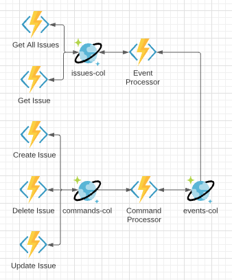

# Software Architecture

To support the issue tracker, an API must be created to provide a way to manipulate and store 
data to any potential clients. This document will define that API, the storage requirements, and 
any other (non-) functional details needed.

## Issue Structure

An issue will be defined with the following JSON structure.

```json
{
  "id": 0,
  "title": "",
  "description": "",
  "state": "",
  "priority": 0,
  "created": "timestamp",
  "updated": "timestamp",
  "deleted": "timestamp",
  "history": []
}
```

## API Endpoints

The endpoints will follow a basic REST/CRUD structure for creating and manipulating issues.

1. Get All Issues - `GET /api/issues`
2. Get Issue - `GET /api/issues/{id}`
3. Create Issue - `POST /api/issues`
4. Update Issue - `PUT /api/issues/{id}`
5. Delete Issue - `DELETE /api/issues/{id}`

## Validation

* Getting, updating, or deleting a specific issue should return a 404 if the ID is invalid.
* When creating an issue, both title and description are required fields. Priority is optional. State 
is set automatically.

## Database Design

While this design easily sets up for a relational database, this project will use Azure's Cosmos 
database. This NoSQL store is going to be used for 2 separate reasons. First, I do not know what the 
final shape of each issue will be. Therefore it will be easier to design a schemaless document and add 
to it where appropriate. Second, I will be taking advantage of the Cosmos change feed to implement an 
event sourcing architecture that will be defined below.

Because of the nature of the NoSQL DB. The only changes from the issue schema defined in the `Issue 
Structure` section above and the database schema below is the `id` field. In Cosmos, I will be using a 
`GUID` for the `id` field and adding an extra `issueId` field for the autoincrementing, easy to read ID.

## API Design



The above design shows an event sourcing architecture with CQRS for this issue tracker. The uses of 
event sourcing and CQRS provide 2 main needs for the system.

1. Event Sourcing will provide a history of all changes to an issue and can provide that via API.
2. CQRS will allow for multiple users to make changes to an issue without conflict since changes happen 
via command processing instead of direct database manipulation.

The tradeoff for an asynchronous event sourcing implementation as shown is the need for eventual 
consistency. This is a fancy way of saying the GET endpoint for an issue will not immediately return 
the data that was just changed via an update or delete. This delay can be a few milliseconds or longer 
depending on the network and other infrastructure bottlenecks. Since this is not a large production 
system, a second or two of delay will be acceptable.

This also shows the how the decision for Cosmos was made. The use of the change feed provides a way to 
manage asynchronous messaging without having to create more infrastructure in a messaging bus nor 
implement transactional outboxes, etc.

Azure Functions are being chosen for 3 reasons.

1. I work with Azure Functions daily so it is my go to choice for development currently.
2. If I do ever want to deploy this to Azure, I can use a consumption plan and keep the price down very 
low.
3. Azure Functions provides bindings for Cosmos to make this be possible in the least amount of code.

## Event Sourcing and CQRS

Commands are created with the following schema.

```json
{
  "id": GUID,
  "aggregateId": GUID,
  "type": string,
  "data": string,
  "created": datetime,
  "userId": string
}
```

The ID field is unique for each command. The aggregate ID is the ID of the object we are modifying - 
in this case it is the issue. The type is a string representation of the concrete command type being 
serialized and the data is the JSON representation of the command. The created timestamp is the UTC 
date of when the command was created and the user ID is the ID of the user that generated this 
command. This is used for traceability and added to the event for an audit trail.

Events follow a very similar schema defined below.

```json
{
  "id": GUID,
  "aggregateId": GUID,
  "commandId": GUID,
  "type": string,
  "data": string,
  "created": datetime,
  "userId": string
}
```

The only additional field is the command ID. This is used for traceability so that each created event 
can be traced back to the command that generated it. Most commands may generate only 1 event; however, 
each event can technically create 0 or more events.

In this application, the following commands will be implemented:

1. CreateIssueCommand - This command will include an ID, title, description, and priority. The ID will 
   be generated by the system. The title and description are required and non-empty. The priority 
   field is optional.
2. UpdateIssueCommand - This command will be used to update the title, description, or priority. It 
   may create up to 3 of the events defined below.
3. DeleteIssueCommand - This command will be used to soft delete an issue.

The following commands will be generated only if a change to the aggregate is required when the 
command is applied.

1. IssueCreatedEvent - The event will generate an issue read model with the input ID, title, and 
   description. Additionally, the created and last modified timestamp will be set to the created 
   timestamp of the create command. Lastly, the event will be logged in the read model's history 
   array.
2. TitleUpdatedEvent - This event will change the title in the read model, update the last modified 
   timestamp, and add the event to the read model's history.
3. DescriptionUpdatedEvent - Same as title but with description.
4. PriorityUpdatedEvent - Same as title but with priority.
5. IssueDeletedEvent - Sets the last modified and deleted timestamp of the issue read model to the 
   created timestamp of the command.
